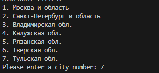

# Project-Parser

Небольшой скрипт для парсинга страниц с товаром и записи (цены, рейтинга, отзывов и скриншота страницы) на локальный диск

## Описание

Проект использует puppeteer библиотеку для работы с браузером и парсингом страниц.

## Установка

Склонируйте репозиторий (git clone)
После загрузки установите все зависимости (npm i)

Скрипт запускается следующим образом:

node index.js "url" магазина с определённым товаром
После вам будет предложен выбор из городов пристуствующих в фильтре сайта

После выбора города, скрипт начнёт работу и запишет результаты в рабочую область
